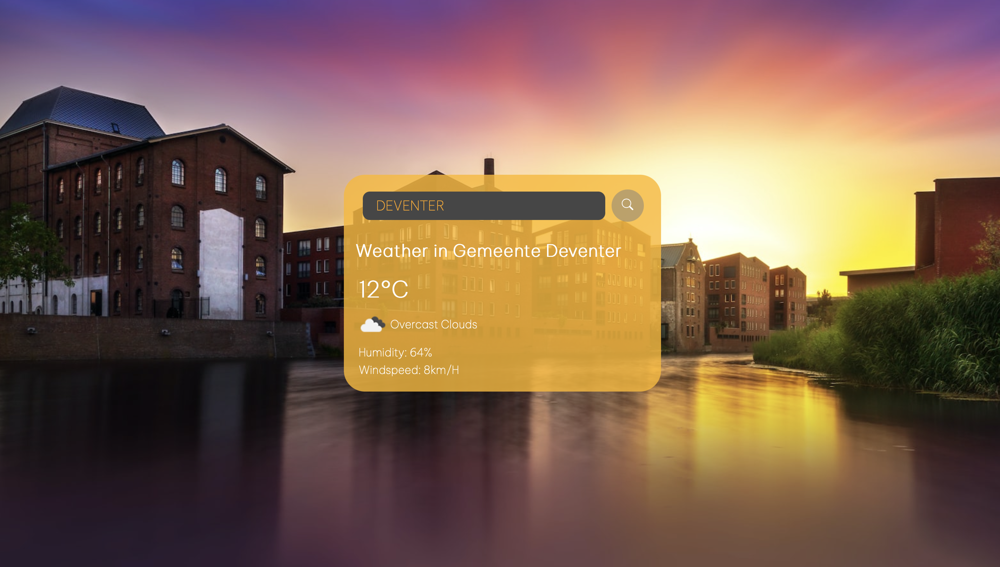

# weather-js

> ### This is a simple weather website, where you can enter any city in the world to check the temperature, wind speed and humitiy. There is a background picture, which changes with the city you type.

## https://weather-checker-d9c39.web.app/

## Possible things to add:

- Color picker
- City time

> #### Screenshots
>
> - 
> - 
> - 
> - 
> - 
> - 
> - 
